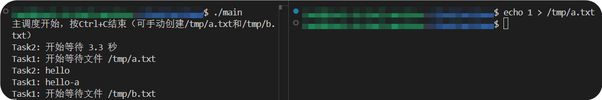
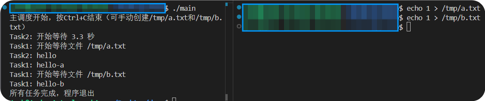

# 笔试题目
> 假设在linux下上，只能用单线程， 不准用多线程，多进程。用 C 语言 （ 可以用gcc扩展） 实现一个例子： 执行2个耗时较长的任务 。 不准用 setjmp/longjmp ,也不准用任何 其他的 栈切换
## 说明
```task1 先等待 /tmp/a.txt 的内容 从 0 字节变为 1字节， 然后打印 hello-a ; 然后再去等待 /tmp/b.txt 的内容 从 0 字节变为 1字节， 然后打印 hello-b; 最后task1 终止运行 。
task2 : 需要 等待 N 秒（ N 可以是个随机数）， 然后打印 hello , 然后 task2 终止运行 。
task1 和 task2 需要同时启动 ， 同时运行。 如果你在task2 里用 sleep(N) 的话，那么 在这个单线程程序里就会阻塞，导致 task1 无法执行。 
为了方便移植，尽量用 标准 C 来实现。代码需要尽量 “通用化”
```
## 测试方法
1. 编译运行：`gcc main.c -o main -lrt`
2. 手动触发任务 1:
    - 执行` echo 1 > /tmp/a.txt`，任务 1 打印 `hello-a`；
    - 执行` echo 1 > /tmp/b.txt`，任务 1 打印 `hello-b`并完成；
3. 任务 2 会在随机时间（2~6 秒）后自动打印hello并完成；
4. 所有任务完成后，程序自动退出。
## 测试结果
step1: `gcc main.c -o main -lrt`<br>
step2: `./main`<br>
step3: `echo 1 > /tmp/a.txt`<br>

step4: `echo 1 > /tmp/b.txt`<br>

